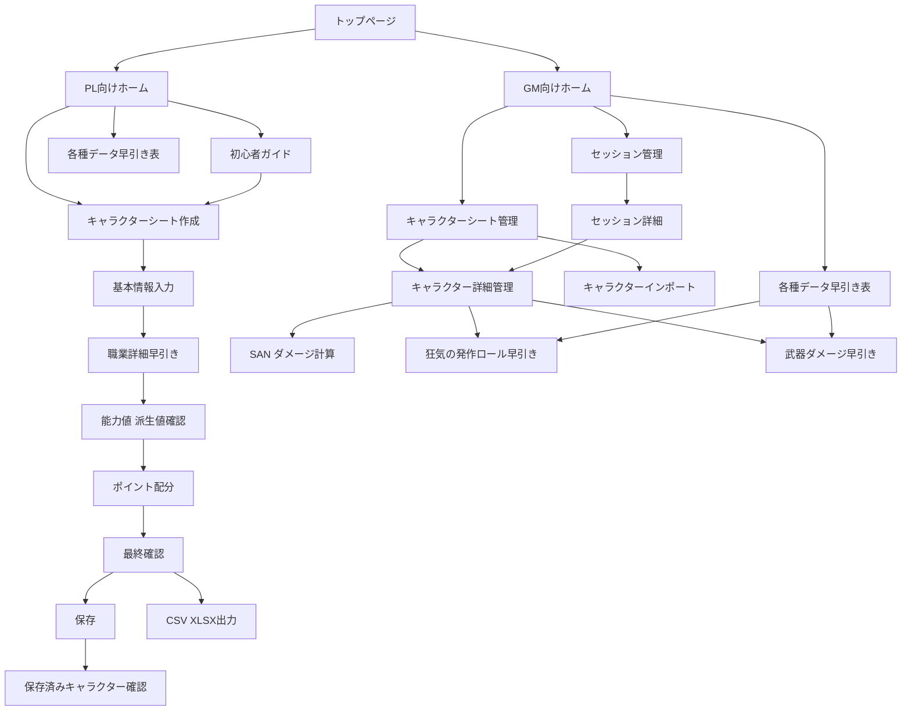

# UI遷移設計

## 目的
- 差別化要件を画面導線に落とし込む
- 「GM向け」「PL向け」の入口で迷わず分岐できるようにする
- 実装順と画面責務を明確にする

## グローバルナビゲーション
- トップページ
- GM向け
- PL向け
- セッション管理
- 早引き
- 初心者ガイド

補足:
- スマホでは下部ナビゲーション
- PCでは上部ナビゲーション + パンくず
- トップページから GM / PL の2系統へ分岐させる

## 主要導線

### 導線A: PL 初心者の初回作成
1. トップページ
2. PL向けホーム
3. 初心者ガイド
4. キャラクターシート作成: 基本情報入力
5. 職業詳細早引き
6. 能力値、派生値確認
7. ポイント配分
8. 最終確認
9. 保存
10. 保存済みキャラクター確認

### 導線B: PL 経験者の素早い作成
1. トップページ
2. PL向けホーム
3. キャラクターシート作成: 基本情報入力
4. 職業詳細早引き
5. 能力値、派生値確認
6. ポイント配分
7. 最終確認
8. 保存または出力

### 導線C: GM のセッション準備
1. トップページ
2. GM向けホーム
3. セッション管理
4. セッション新規作成
5. キャラクター一覧から参加者を追加
6. 各種データ早引き表で必要情報を確認

### 導線D: GM のセッション中利用
1. トップページ または 最近使ったセッション
2. GM向けホーム
3. セッション管理
4. 対象セッション詳細
5. キャラクター管理
6. SAN/ダメージ計算モーダル
7. 狂気の発作ロール早引き
8. 武器ダメージ早引き
9. 履歴保存

### 導線E: ルール確認だけしたい場合
1. トップページ
2. GM向けホーム または PL向けホーム
3. 各種データ早引き表
4. 職業 / 武器 / 狂気表 / 用語集

## 画面遷移ルール
- 新規作成フローでは、前に戻っても入力値を保持する
- トップページは常に GM / PL の分岐点として戻り先を明確にする
- 最終確認からは
  - 保存
  - 出力
  - 管理画面へ進む
  の3経路を明示する
- 早引き機能は単独でも使えるが、キャラクター管理またはセッション管理から開いた場合は対象キャラや対象セッションに結果を反映できる
- 初心者ガイドから各作成画面へディープリンクできる
- GM向け配下では、キャラクター単位の操作とセッション単位の操作を分ける
- キャラクターインポートは GM向けのキャラクター管理から入れる

## 状態設計の考え方
- 作成中状態
  - 基本情報
  - 職業選択
  - 能力値
  - 派生値
  - 技能配分
- 保存済み状態
  - キャラ基本情報
  - 現在HP、MP、SAN
  - 所持武器
  - 発狂履歴
  - セッションメモ
- セッション状態
  - セッション名
  - 開催日
  - 参加キャラクターID一覧
  - セッションログ
  - セッション内変動履歴
- 参照データ
  - 職業データ
  - 武器データ
  - 狂気表データ
  - 用語解説データ

## 実装優先画面

### Phase 1
- トップページ
- GM向けホーム
- PL向けホーム
- 基本情報入力
- 職業詳細早引き
- 能力値、派生値確認
- ポイント配分
- 最終確認

### Phase 2
- 初心者ガイド
- キャラクター一覧
- キャラクター管理
- 各種データ早引き表

### Phase 3
- セッション管理
- 狂気の発作ロール早引き
- 武器ダメージ早引き
- SAN/ダメージ計算モーダル
- キャラクターインポート

## Mermaid遷移図

## 結論
- トップページで GM / PL の入口を分けると、目的別に迷いにくい
- ただし内部では「作成」「早引き」「管理」「セッション運用」を接続し、作ったキャラをそのまま使い続けられる状態を作る
- 差別化要件は独立機能ではなく、作成後の運用導線に組み込むことで価値が出る